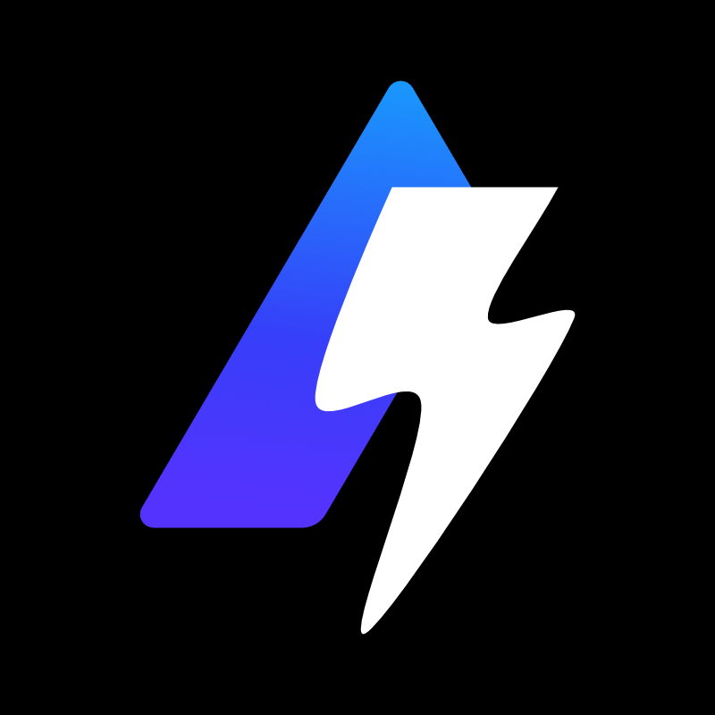

# Supercharger
**A GitHub bot for managing projects built by the [Alchemy](https://alchemy.com) community on GitHub easily**

[Contribute to this repository](https://github.com/cytronicoder/supercharger/pulls) · [Report a bug/request a feature](https://github.com/cytronicoder/supercharger/issues)

 

    
    <h3>What is Supercharger?</h3>
    
Supercharger is a Github bot that guides first-time contributors to create their first pull request and allows project collaborators to create custom tests and deployment workflows in Alchemy open-source projects.<b>Note that this project is still in development - join the <a href="https://discord.gg/RbZtCrzWKY">Alchemy Platform Discord server</a> for updates.</b>

 

## Roadmap
<h4>In progress</h4>

- [ ] Basic checks for pull request
  - [ ] Code style
  - [ ] Tests and deployment
- [ ] New contributors guide and onboarding process: Reply to pull request with link to `CONTRIBUTING.md` and make sure the contributor is mindful of the contribution guidelines
- [ ] Webhook integration for updates from GitHub to Discord
- [ ] Documentation and usage guides

<h4>To do</h4>

- [ ] Automated merge and deletion of pull requests
- [ ] Custom tests and deployment workflows for projects
- [ ] Package management
