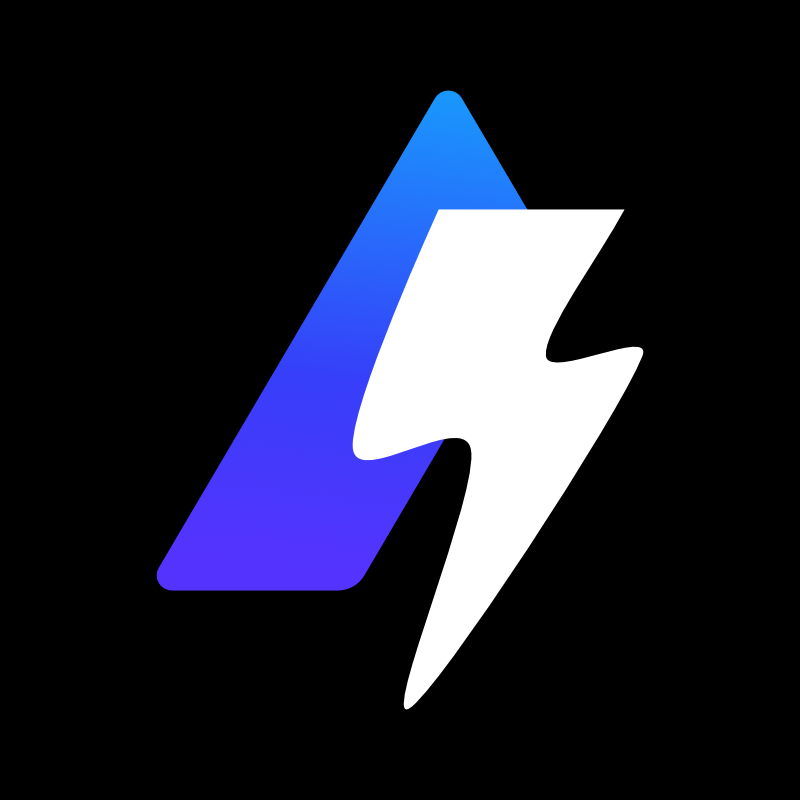

<!-- ALL-CONTRIBUTORS-BADGE:START - Do not remove or modify this section -->

<!-- ALL-CONTRIBUTORS-BADGE:END -->

 

    
    <h1>Supercharger</h1>
    <h3>A tool for managing projects built by the <a href="https://alchemy.com">Alchemy</a> community on GitHub easily</h3>
    

        <a href="https://github.com/cytronicoder/supercharger/pulls">Contribute to this repository</a>
        ·
        <a href="https://github.com/cytronicoder/supercharger/issues">Report a bug/request a feature</a>
    

## What is Supercharger?

Supercharger is a Github bot that guides first-time contributors to create their first pull request and allows project collaborators to create custom tests and deployment workflows in Alchemy open-source projects. **Note that this project is still in development - join Alchemy's [Discord server](https://discord.gg/RbZtCrzWKY) for updates.**

## Roadmap

This project is currently in development, and we are actively working on features outlined in the roadmap and updating this page as we progress.

### In progress

- [ ] Basic checks for pull request
  - [ ] Code style
  - [ ] Tests and deployment
- [ ] New contributors guide and onboarding process: Reply to pull request with link to `CONTRIBUTING.md` and make sure the contributor is mindful of the contribution guidelines
- [ ] Webhook integration for updates from GitHub to Discord
- [ ] Documentation and usage guides

### To do

- [ ] Automated merge and deletion of pull requests
- [ ] Custom tests and deployment workflows for projects
- [ ] Package management

## Contributing

If you have suggestions for how Supercharger could be improved, or want to report a bug, open an issue! We'd love all and any contributions.

To contribute to this project, please read the [contribution guidelines](CONTRIBUTING.md) for more information before submitting a pull request to the project.

### Contributors

Many thanks to all of the contributors who have helped make this project a success - you can see a list of all the contributors here ([emoji key](https://allcontributors.org/docs/en/emoji-key)):

<!-- ALL-CONTRIBUTORS-LIST:START - Do not remove or modify this section -->
<!-- prettier-ignore-start -->
<!-- markdownlint-disable -->
<table>
  <tr>
    <td align="center"><a href="https://github.com/cytronicoder"> <b>Zeyu Yao</b></a></td>
  </tr>
</table>

<!-- markdownlint-restore -->
<!-- prettier-ignore-end -->

<!-- ALL-CONTRIBUTORS-LIST:END -->

## License

Supercharger is licensed under the [MIT License](LICENSE).
